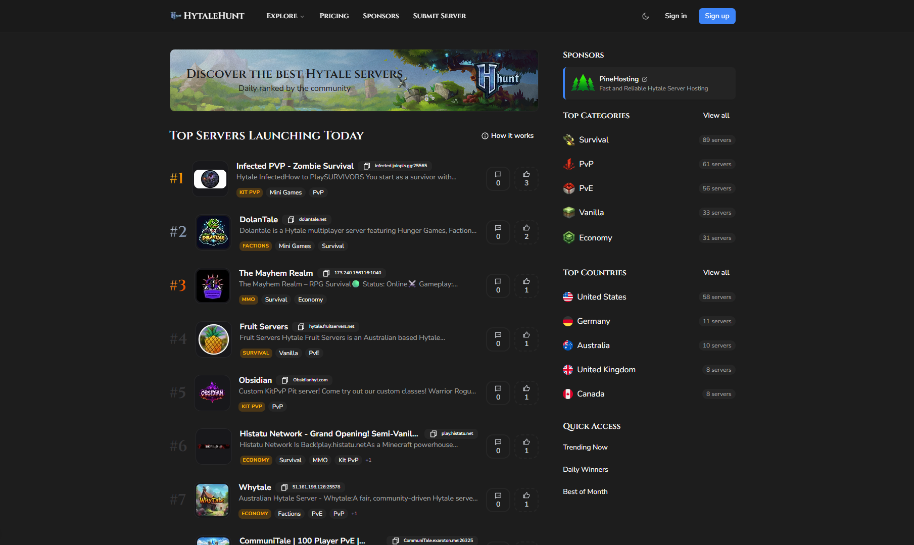

# HytaleHunt

[](https://nextjs.org)
[](https://reactjs.org)
[](https://www.typescriptlang.org)

**HytaleHunt is a platform for Hytale server launches in the ProductHunt's style.**

<div align="center" style="padding: 0px 0px 10px 0px">
  <a href="https://hytalehunt.com" target="_blank">
    
  </a>
</div>



<!-- <div align="center">
  
</div> -->

## 📋 Table of Contents

- [Project Retrospective](#project-retrospective)
- [Features](#features)
- [Quick Start](#quick-start)
- [Tech Stack](#tech-stack)
- [Deployment](#deployment)
- [Sponsoring](#sponsoring)

## Project Retrospective

This project launched on January 17, 2026 and was shut down on February 17, 2026.

During that period, it operated as a niche SaaS experiment. However, because it required constant promotion to keep the model working, I decided to shut it down and prioritize other projects with better returns.

The project generated a total return of $15, which basically covered domain costs. Even so, the operational effort required no longer justified further time investment.

**The main lesson was about product-market fit:** the biggest mistake was trying to innovate the model itself. The Hytale community is more familiar with static server list formats, while this project followed a Product Hunt-inspired approach. In practice, that would require significant ongoing effort to educate users and establish the new concept, time that I preferred to focus on other projects.

## Features

### Platform Capabilities

- **Product Discovery**: Explore the latest launches and trends
- **Voting System**: Upvote your favorite products
- **Categories**: Browse by thematic categories
- **Dashboard**: Personalized user interface
- **Admin Panel**: Administration system
- **Payment System**: Stripe integration for premium features
- **Comments**: Built-in commenting system powered by [Fuma Comment](https://github.com/fuma-nama/fuma-comment)
- **Trending**: Dedicated section for popular products
- **Winners**: Showcase of the best products

### Security & Anti-Spam Features

- **Rate Limiting**
- **Comment Rate Limiting**
- **Vote Rate Limiting**
- **API Rate Limiting**
- **Action Cooldown**
- **Anti-Spam Protection**

### Notification System

- **Discord Integration**

## Quick Start

```bash
# Clone the repository
git clone https://github.com/williangoix/hytalehunt.git
cd hytalehunt

# Install dependencies
bun install

# Set up environment variables
cp .env.example .env

# Initialize the database
bun run db:generate
bun run db:migrate
bun run db:push

# Seed the categories
bun scripts/categories.ts

# Start the development server
bun run dev
```

Visit `http://localhost:3000` to see your app running.

## Tech Stack

### Frontend

| Technology                              | Description                            |
| --------------------------------------- | -------------------------------------- |
| [Next.js 15](https://nextjs.org)        | React framework for production         |
| [React 19](https://reactjs.org)         | UI library                             |
| [Tailwind CSS](https://tailwindcss.com) | Utility-first CSS framework            |
| [Shadcn/ui](https://ui.shadcn.com)      | Accessible and customizable components |
| [MDX](https://mdxjs.com) (`@next/mdx`)  | Blog/content rendering                 |

### Backend

| Technology                                                            | Description                           |
| --------------------------------------------------------------------- | ------------------------------------- |
| [Next.js API Routes](https://nextjs.org/docs/api-routes/introduction) | Serverless API                        |
| [Drizzle ORM](https://orm.drizzle.team)                               | TypeScript ORM                        |
| [PostgreSQL](https://www.postgresql.org)                              | Database                              |
| [Redis](https://redis.io)                                             | Caching and sessions                  |
| [Better Auth](https://better-auth.com)                                | Authentication and session management |
| [Stripe](https://stripe.com)                                          | Payment processing                    |
| [UploadThing](https://uploadthing.com)                                | File uploads                          |
| [Resend](https://resend.com)                                          | Transactional emails                  |

### Analytics & Tracking

| Technology                                                    | Description                                            |
| ------------------------------------------------------------- | ------------------------------------------------------ |
| [Google Analytics 4](https://developers.google.com/analytics) | Client-side analytics via `@next/third-parties/google` |
| [PostHog](https://posthog.com)                                | Product analytics with client + server usage           |

### Security

| Technology                                                            | Description      |
| --------------------------------------------------------------------- | ---------------- |
| [Cloudflare Turnstile](https://www.cloudflare.com/products/turnstile) | Bot protection   |
| [Zod](https://zod.dev)                                                | Data validation  |

### Tooling

| Technology                                                        | Description                                    |
| ----------------------------------------------------------------- | ---------------------------------------------- |
| [Bun](https://bun.sh)                                             | Package/runtime for scripts and local workflow |
| [Biome](https://biomejs.dev)                                      | Linting and formatting                         |
| [Drizzle Kit](https://orm.drizzle.team/docs/drizzle-kit-overview) | Migrations and schema workflow                 |

## Deployment

HytaleHunt is optimized for deployment on Vercel but can be deployed on any platform that supports Next.js.

```bash
# Build the application
bun run build

# Start the production server
bun run start
```